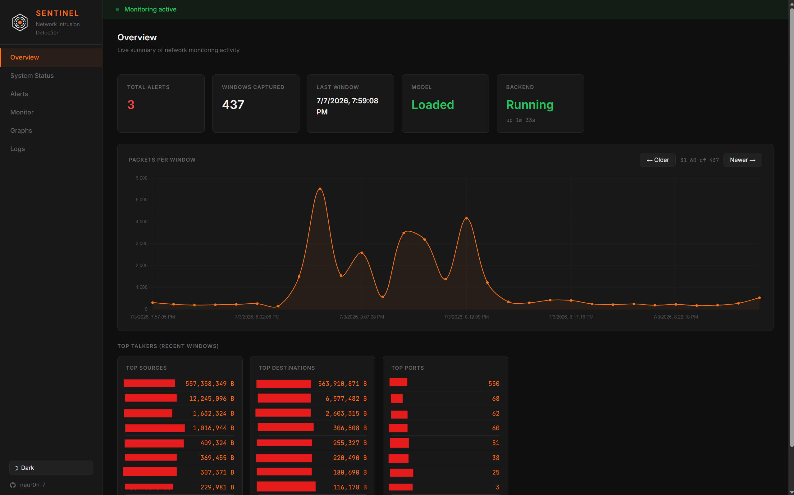
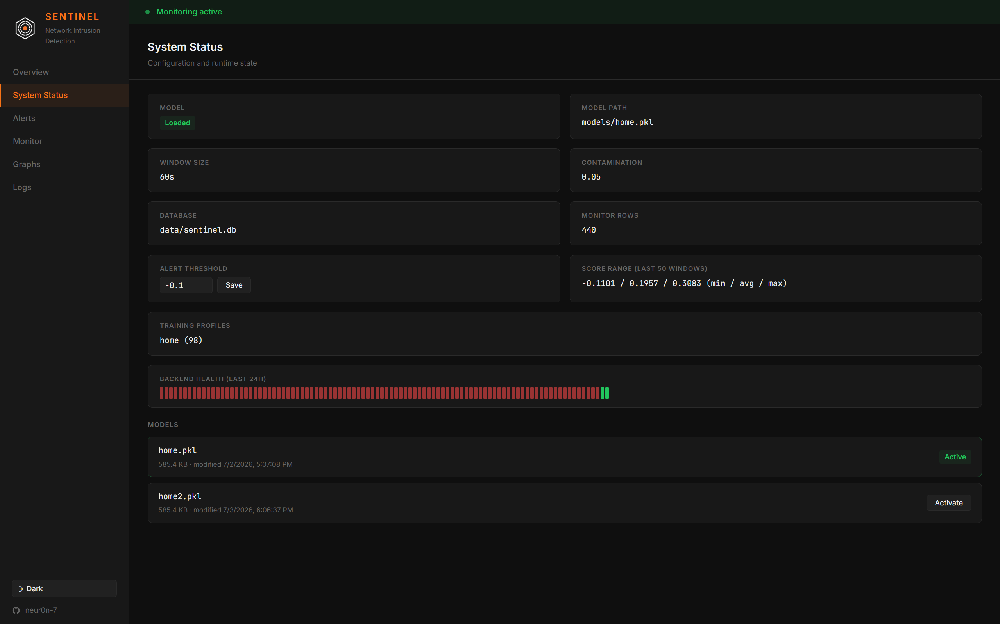
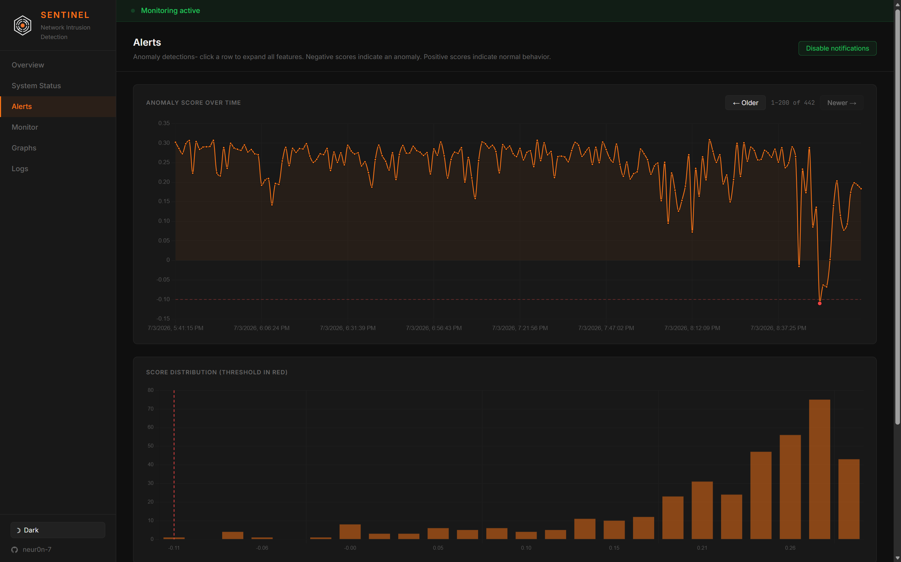
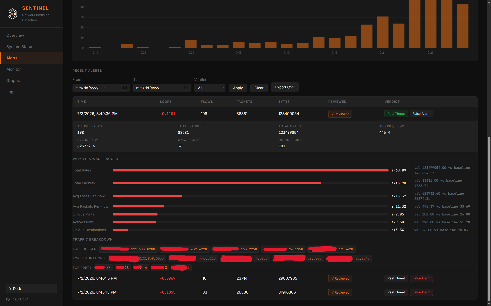
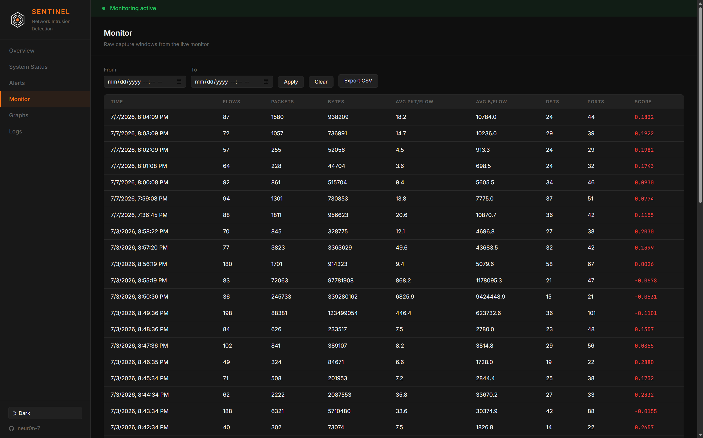
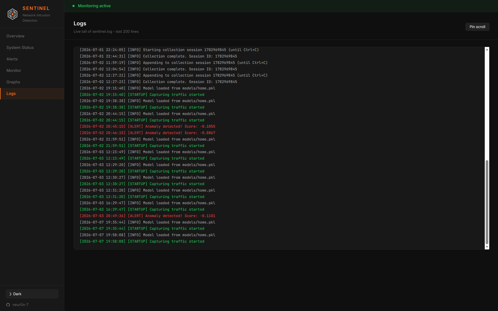
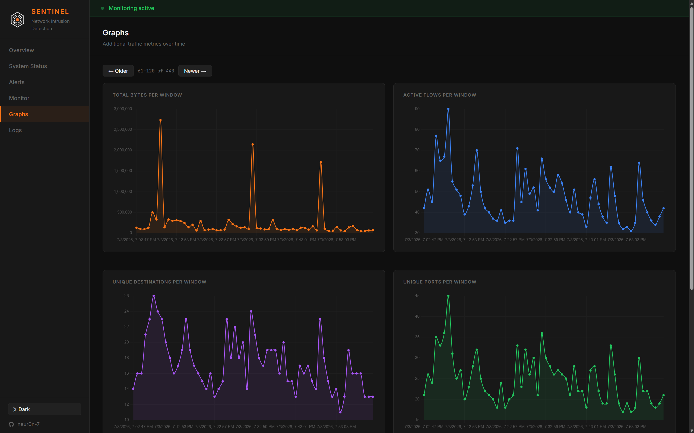
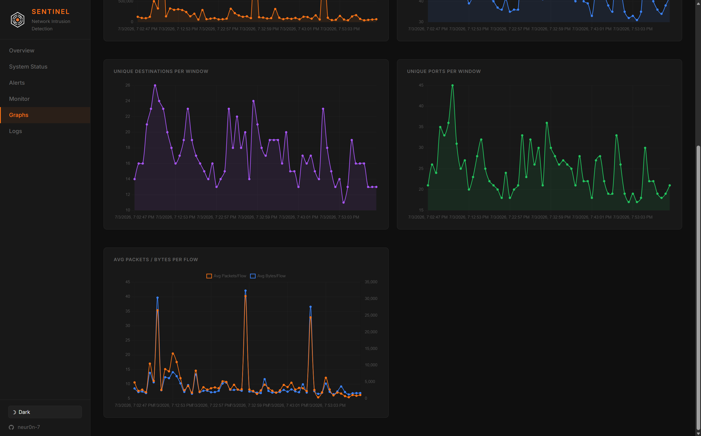

[](https://www.python.org/downloads/)
[](LICENSE)
[]()
[](https://scikit-learn.org/)
[](https://scapy.net/)

A network intrusion detection system (NIDS) that watches live traffic, aggregates it into time windows, and then flags anomalies with an [Isolation Forest](https://scikit-learn.org/stable/modules/generated/sklearn.ensemble.IsolationForest.html) model. 

It includes a dashboard for reviewing alerts and inspecting traffic.


<sub>Overview page of the dashboard. Note that some information is censored</sub>

## How it works

- **Capture backend** (`src/main.py`)  sniffs packets with Scapy, aggregates them into time windows (containing features such as flows, packets, bytes, unique destinations/ports, and top talkers), scores each window with a trained Isolation Forest model, and writes everything to the SQLite database.

- **Dashboard** (`src/web.py`) is a Flask app serving the dashboard for the status, alerts, history, and configuration options

- **Training CLI** (`src/ml.py`) captures traffic into named "profiles" and trains an Isolation Forest on said profile, saved to `models/<name>.pkl`. This lets you train several models for several scenarios, like one for work, one for home, etc.

## Features

- Live capture of TCP/UDP traffic aggregated into scoring windows
- Isolation Forest anomaly detection with per-alert feature attribution (z-scores against the training baseline. This is super helpful because it lets you see why a window was flagged, not just its anomaly score)
- Stores top source IPs, destination IPs, and ports, both per-window and aggregated
- Anomaly score chart and score distribution histogram with the alert threshold overlaid, for visually tuning sensitivity
- Threshold editing from the dashboard (writes back to the `config/config.yml` file)
- Alert workflow: acknowledge alerts and label them true/false positive
- Time-range filtering and CSV export for alerts and monitor history
- Browser notifications + sound on new alerts
- Backend health history strip (last 24h up/down) and a distinct "capture paused" state (backend alive but no new windows) separate from "backend offline"
- Dark/light theme toggle
- Live log tail

## Requirements

- Python 3.10+
- Packet capture privileges:
  - **Windows**: install [Npcap](https://npcap.com/) and run the capture process (`src/main.py`) as Administrator.
  - **Linux/macOS**: run as root, or grant the Python interpreter `CAP_NET_RAW`/`CAP_NET_ADMIN` (e.g. `sudo setcap cap_net_raw,cap_net_admin+eip $(which python3)`).

## Installation

```bash
git clone https://github.com/neur0n-7/sentinel-nids.git
python -m venv .venv
.venv\Scripts\activate        # Windows step
source .venv/bin/activate     # Linux/macOS step
pip install -r requirements.txt
```

## Configuration

All settings are in `config/config.yml`:

| Key | Description |
|---|---|
| `dashboard.host` / `dashboard.port` | Flash dashboard host and port |
| `dashboard.heartbeat_interval` | Seconds between backend heartbeat pings |
| `aggregation.window` | Length of each capture/scoring window, in seconds |
| `logging.file` | Log filename, written under `logs/` |
| `database.path` | SQLite database path |
| `model.path` | Model file loaded by the capture backend at startup |
| `model.contamination` | Expected anomaly fraction, used only at training time |
| `model.alert_threshold` | Score below which a window triggers an alert (negative means an anomoly). Can also be edited live from the System Status page on the dashboard. |

## Usage

### 1. Train a model

The IsolationForest algorithm learns by being provided with a baseline of "normal" data. The training step allows you to capture a baseline of "normal" traffic into a named profile, then train on it:

```bash
python src/ml.py collect --profile home --minutes 45
python src/ml.py collect --profile home # runs until you ctrl c

python src/ml.py train --profile home --file homeModel
```

This writes the saved model to`models/homeModel.pkl`. Set `model.path` in `config/config.yml` to it.

### 2. Run the capture backend

```bash
python src/main.py
```

Loads the configured model (if the model path is invalid, it will run in capture-only mode without one) and starts sniffing and the backend processes.

### 3. Run the dashboard

```bash
python src/web.py
```

Open `http://127.0.0.1:5000` (or whatever `dashboard.host`/`dashboard.port` are set to).

## Dashboard tour

<details><summary><strong>Overview</strong> - headline stats, packets-per-window sparkline, top talkers</summary>


<sub>Note: some information is censored</sub>
</details>

<details><summary><strong>System Status</strong> - model/config info, live threshold editor, score range, backend health strip</summary>


</details>

<details><summary><strong>Alerts</strong> - score over time chart, score distribution histogram, filterable/exportable alert table with per-alert feature attribution, traffic breakdown, ack/label controls</summary>



<sub>Note: some information is censored</sub>
</details>

<details><summary><strong>Monitor</strong> - paginated, filterable, exportable raw window history</summary>


</details>

<details><summary><strong>Logs</strong> - live tail of <code>logs/sentinel.log</code></summary>


</details>

<details><summary><strong>Graphs</strong> - historical traffic metrics: bytes, flows, destinations, ports, and averages per window</summary>



</details>

## Project structure

```
config/config.yml       # all runtime configuration
src/
  main.py               # capture backend entrypoint
  backend.py            # packet capture, feature extraction, inference
  ml.py                 # training CLI (collect / train)
  web.py                # Flask dashboard + JSON API
  database.py            # SQLite schema and queries
  static/               # dashboard JS/CSS
  templates/            # dashboard HTML
data/                   # SQLite database (gitignored)
models/                 # trained model pickles
logs/                   # log output
```

## Notes

- The Isolation Forest is trained on 7 aggregate features per window (active flows, total packets/bytes, averages per flow, unique destinations, unique ports), and it detects unusual *shapes* of traffic, not signature-based attacks.

